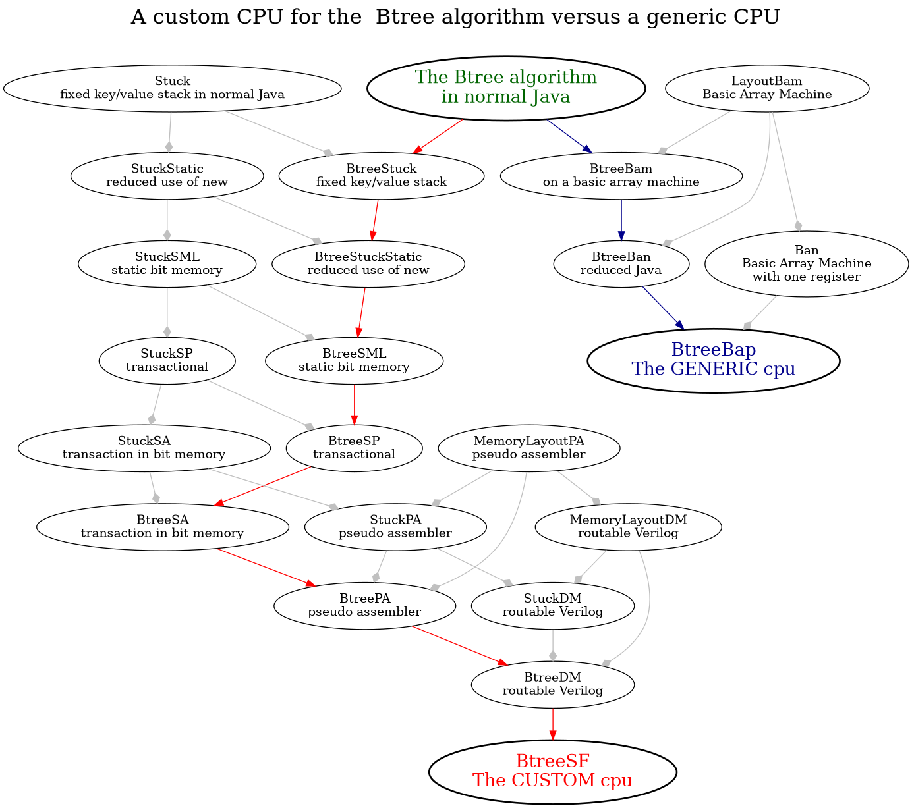

<div>
    <p><a href="https://github.com/philiprbrenan/btreeBlock"></a>
</div>

# Btree in a block

An implementation of the [B-Tree](https://en.wikipedia.org/wiki/B-tree) algorithm in synthesized, placed and routed
Verilog targeted at a [Advanced Micro Devices XC7A50T0](https://www.amd.com/en/products/adaptive-socs-and-fpgas/fpga/artix-7.html#product-table) [Field Programmable Gate Array](https://en.wikipedia.org/wiki/Field-programmable_gate_array) .

For reasons why you might want to get involved in this implementation of the [B-Tree](https://en.wikipedia.org/wiki/B-tree) algorithm in [Silicon](https://en.wikipedia.org/wiki/Silicon) rather than [software](https://en.wikipedia.org/wiki/Software) see:

https://prb.appaapps.com/zesal/presentation/index.html

A more detailed presentation:

http://prb.appaapps.com/zesal/pitchdeck/pitchDeck.html

# Installation

See this [action](https://github.com/philiprbrenan/btreeBlock/blob/main/.github/workflows/main.yml).

# Roadmap

I implemented the [B-Tree](https://en.wikipedia.org/wiki/B-tree) algorithm in [Java](https://en.wikipedia.org/wiki/Java_(programming_language)), then successively reduced the [Java](https://en.wikipedia.org/wiki/Java_(programming_language)) [code](https://en.wikipedia.org/wiki/Computer_program) until it looked just like [assembler](https://en.wikipedia.org/wiki/Assembly_language#Assembler) [code](https://en.wikipedia.org/wiki/Computer_program), at which point it was easy to
generate a [code](https://en.wikipedia.org/wiki/Computer_program) in [Verilog](https://en.wikipedia.org/wiki/Verilog) to execute the [assembler](https://en.wikipedia.org/wiki/Assembly_language#Assembler) [code](https://en.wikipedia.org/wiki/Computer_program).  The resulting design
was compacted by reusing identical instructions and pipelined to reduce
congestion. 

# Synthesis, Placement and Routing

## Vivado

The logs of the successful synthesis, placement and routing of the individual
components of [Database on a Chip](http://prb.appaapps.com/zesal/pitchdeck/pitchDeck.html) using [Vivado](https://en.wikipedia.org/wiki/Xilinx_Vivado) targeting an [Advanced Micro Devices XC7A50T0](https://www.amd.com/en/products/adaptive-socs-and-fpgas/fpga/artix-7.html#product-table) [Field Programmable Gate Array](https://en.wikipedia.org/wiki/Field-programmable_gate_array) can be seen here:


 [delete](https://github.com/philiprbrenan/btreeBlock/blob/main/verilog/delete/vivado/reports),

 [find  ](https://github.com/philiprbrenan/btreeBlock/tree/main/verilog/find/vivado/reports),

 [put   ](https://github.com/philiprbrenan/btreeBlock/blob/main/verilog/put/vivado/reports).


## OpenRoad

Open Road successfully compiles the ``find``, ``delete`` and ``put`` operations
onto [freepdk-45nm](https://github.com/mflowgen/freepdk-45nm) [Silicon](https://en.wikipedia.org/wiki/Silicon) .  The following images show the layout of [Silicon](https://en.wikipedia.org/wiki/Silicon) for each operation:

### Put

 ,

### Delete

 ,

### Find

 .

## Gowin Tang Nano 9K

The ``find`` operation is small enough to be run on a Gowin Tang Nano 9K [Field Programmable Gate Array](https://en.wikipedia.org/wiki/Field-programmable_gate_array), see:


# Example: finding the [data](https://en.wikipedia.org/wiki/Data) associated with a [database key](https://en.wikipedia.org/wiki/Key%E2%80%93value_database) 
For a small [tree](https://en.wikipedia.org/wiki/Tree_(data_structure)): 
```
   BtreePA t = new BtreePA()
     {int maxSize         () {return  8;}
      int maxKeysPerLeaf  () {return  2;}
      int maxKeysPerBranch() {return  3;}
      int bitsPerKey      () {return  4;}
      int bitsPerData     () {return  4;}
     };
```
 [Vivado](https://en.wikipedia.org/wiki/Xilinx_Vivado) Synthesis uses the following resources to implement the **find**
operation.

```
INFO: [Synth 8-6157] synthesizing module 'find' [/home/azureuser/btreeBlock/verilog/find/2/find.v:6]
+------+---------+-------+------+
|      |Instance |Module |Cells |
+------+---------+-------+------+
|1     |top      |       |   532|
+------+---------+-------+------+
---------------------------------------------------------------------------------
Finished Writing Synthesis Report : Time (s): cpu = 00:00:30 ; elapsed = 00:00:32 . Memory (MB): peak = 2154.945 ; gain = 721.441 ;
---------------------------------------------------------------------------------
Synthesis finished with 0 errors, 0 critical warnings and 53 warnings.
```
 [Vivado](https://en.wikipedia.org/wiki/Xilinx_Vivado) Synthesis uses the following resources to implement the **put**
operation.

```
INFO: [Synth 8-6157] synthesizing module 'put' [/home/azureuser/btreeBlock/verilog/put/2/put.v:6]
+------+---------+-------+-------+
|      |Instance |Module |Cells  |
+------+---------+-------+-------+
|1     |top      |       | 148348|
+------+---------+-------+-------+
---------------------------------------------------------------------------------
Finished Writing Synthesis Report : Time (s): cpu = 00:24:57 ; elapsed = 00:25:45 . Memory (MB): peak = 3180.359 ; gain = 1746.855 ;
---------------------------------------------------------------------------------
Synthesis finished with 0 errors, 0 critical warnings and 80 warnings.
```
 [Vivado](https://en.wikipedia.org/wiki/Xilinx_Vivado) Synthesis uses the following resources to implement the **delete**
operation.

```
INFO: [Synth 8-6157] synthesizing module 'delete' [/home/azureuser/btreeBlock/verilog/delete/2/delete.v:6]
+------+---------+-------+-------+
|      |Instance |Module |Cells  |
+------+---------+-------+-------+
|1     |top      |       | 119947|
+------+---------+-------+-------+
---------------------------------------------------------------------------------
Finished Writing Synthesis Report : Time (s): cpu = 00:19:27 ; elapsed = 00:20:11 . Memory (MB): peak = 3132.988 ; gain = 1699.551 ;
---------------------------------------------------------------------------------
Synthesis finished with 0 errors, 0 critical warnings and 55 warnings.
```


The [tree](https://en.wikipedia.org/wiki/Tree_(data_structure)) being searched looks like this:

```
    ok(t, """
             4                    |
             0                    |
             5                    |
             6                    |
      2             6    7        |
      5             6    6.1      |
      1             4    7        |
      3                  2        |
1,2=1  3,4=3  5,6=4  7=7    8,9=2 |
""");
```

Running the generated [Verilog](https://en.wikipedia.org/wiki/Verilog) [code](https://en.wikipedia.org/wiki/Computer_program) to [find](https://en.wikipedia.org/wiki/Find_(Unix)) the [data](https://en.wikipedia.org/wiki/Data) associated with [database key](https://en.wikipedia.org/wiki/Key%E2%80%93value_database) **2**
produces:

```
Stopped after:  117 steps key    2  data    7
```

# Deleting in ascending order

The evolution of a [B-Tree](https://en.wikipedia.org/wiki/B-tree) as the lowest element is deleted successively until
the [tree](https://en.wikipedia.org/wiki/Tree_(data_structure)) is empty.

```
At start with 32 elements
+----------------------------------------------------------------------------------------------------------------------------+
|                                                        16                                24                                |
|                                                        0                                 0.1                               |
|                                                        7                                 18                                |
|                                                                                          8                                 |
|           4          8               12                                 20                                 28              |
|           7          7.1             7.2                                18                                 8               |
|           1          4               6                                  12                                 17              |
|                                      10                                 15                                 2               |
| 1,2,3,4=1  5,6,7,8=4    9,10,11,12=6    13,14,15,16=10   17,18,19,20=12   21,22,23,24=15    25,26,27,28=17   29,30,31,32=2 |
+----------------------------------------------------------------------------------------------------------------------------+
After deleting: 1
+-----------------------------------------------------------------------------------------------------------------------------+
|                                                      16                                                                     |
|                                                      0                                                                      |
|                                                      7                                                                      |
|                                                      18                                                                     |
|         4          8               12                                 20               24                 28                |
|         7          7.1             7.2                                18               18.1               18.2              |
|         1          4               6                                  12               15                 17                |
|                                    10                                                                     2                 |
| 2,3,4=1  5,6,7,8=4    9,10,11,12=6    13,14,15,16=10   17,18,19,20=12   21,22,23,24=15     25,26,27,28=17     29,30,31,32=2 |
+-----------------------------------------------------------------------------------------------------------------------------+
After deleting: 2
+---------------------------------------------------------------------------------------------------------------------------+
|                                                    16                                                                     |
|                                                    0                                                                      |
|                                                    7                                                                      |
|                                                    18                                                                     |
|       4          8               12                                 20               24                 28                |
|       7          7.1             7.2                                18               18.1               18.2              |
|       1          4               6                                  12               15                 17                |
|                                  10                                                                     2                 |
| 3,4=1  5,6,7,8=4    9,10,11,12=6    13,14,15,16=10   17,18,19,20=12   21,22,23,24=15     25,26,27,28=17     29,30,31,32=2 |
+---------------------------------------------------------------------------------------------------------------------------+
After deleting: 3
+-------------------------------------------------------------------------------------------------------------------------+
|                                                  16                                                                     |
|                                                  0                                                                      |
|                                                  7                                                                      |
|                                                  18                                                                     |
|     4          8               12                                 20               24                 28                |
|     7          7.1             7.2                                18               18.1               18.2              |
|     1          4               6                                  12               15                 17                |
|                                10                                                                     2                 |
| 4=1  5,6,7,8=4    9,10,11,12=6    13,14,15,16=10   17,18,19,20=12   21,22,23,24=15     25,26,27,28=17     29,30,31,32=2 |
+-------------------------------------------------------------------------------------------------------------------------+
After deleting: 4
+------------------------------------------------------------------------------------------------------------------+
|                                           16                                                                     |
|                                           0                                                                      |
|                                           7                                                                      |
|                                           18                                                                     |
|           8             12                                 20               24                 28                |
|           7             7.1                                18               18.1               18.2              |
|           1             6                                  12               15                 17                |
|                         10                                                                     2                 |
| 5,6,7,8=1  9,10,11,12=6    13,14,15,16=10   17,18,19,20=12   21,22,23,24=15     25,26,27,28=17     29,30,31,32=2 |
+------------------------------------------------------------------------------------------------------------------+
After deleting: 5
+----------------------------------------------------------------------------------------------------------------+
|                                         16                                                                     |
|                                         0                                                                      |
|                                         7                                                                      |
|                                         18                                                                     |
|         8             12                                 20               24                 28                |
|         7             7.1                                18               18.1               18.2              |
|         1             6                                  12               15                 17                |
|                       10                                                                     2                 |
| 6,7,8=1  9,10,11,12=6    13,14,15,16=10   17,18,19,20=12   21,22,23,24=15     25,26,27,28=17     29,30,31,32=2 |
+----------------------------------------------------------------------------------------------------------------+
After deleting: 6
+--------------------------------------------------------------------------------------------------------------+
|                                       16                                                                     |
|                                       0                                                                      |
|                                       7                                                                      |
|                                       18                                                                     |
|       8             12                                 20               24                 28                |
|       7             7.1                                18               18.1               18.2              |
|       1             6                                  12               15                 17                |
|                     10                                                                     2                 |
| 7,8=1  9,10,11,12=6    13,14,15,16=10   17,18,19,20=12   21,22,23,24=15     25,26,27,28=17     29,30,31,32=2 |
+--------------------------------------------------------------------------------------------------------------+
After deleting: 7
+------------------------------------------------------------------------------------------------------------+
|                                     16                                                                     |
|                                     0                                                                      |
|                                     7                                                                      |
|                                     18                                                                     |
|     8             12                                 20               24                 28                |
|     7             7.1                                18               18.1               18.2              |
|     1             6                                  12               15                 17                |
|                   10                                                                     2                 |
| 8=1  9,10,11,12=6    13,14,15,16=10   17,18,19,20=12   21,22,23,24=15     25,26,27,28=17     29,30,31,32=2 |
+------------------------------------------------------------------------------------------------------------+
After deleting: 8
+------------------------------------------------------------------------------------------------------+
|                               16                                                                     |
|                               0                                                                      |
|                               7                                                                      |
|                               18                                                                     |
|              12                                20               24                 28                |
|              7                                 18               18.1               18.2              |
|              1                                 12               15                 17                |
|              10                                                                    2                 |
| 9,10,11,12=1   13,14,15,16=10   17,18,19,20=12   21,22,23,24=15     25,26,27,28=17     29,30,31,32=2 |
+------------------------------------------------------------------------------------------------------+
After deleting: 9
+---------------------------------------------------------------------------------------------------+
|                                               20                                                  |
|                                               0                                                   |
|                                               7                                                   |
|                                               18                                                  |
|            12               16                                 24               28                |
|            7                7.1                                18               18.1              |
|            1                10                                 15               17                |
|                             12                                                  2                 |
| 10,11,12=1   13,14,15,16=10    17,18,19,20=12   21,22,23,24=15   25,26,27,28=17     29,30,31,32=2 |
+---------------------------------------------------------------------------------------------------+
After deleting: 10
+------------------------------------------------------------------------------------------------+
|                                            20                                                  |
|                                            0                                                   |
|                                            7                                                   |
|                                            18                                                  |
|         12               16                                 24               28                |
|         7                7.1                                18               18.1              |
|         1                10                                 15               17                |
|                          12                                                  2                 |
| 11,12=1   13,14,15,16=10    17,18,19,20=12   21,22,23,24=15   25,26,27,28=17     29,30,31,32=2 |
+------------------------------------------------------------------------------------------------+
After deleting: 11
+---------------------------------------------------------------------------------------------+
|                                         20                                                  |
|                                         0                                                   |
|                                         7                                                   |
|                                         18                                                  |
|      12               16                                 24               28                |
|      7                7.1                                18               18.1              |
|      1                10                                 15               17                |
|                       12                                                  2                 |
| 12=1   13,14,15,16=10    17,18,19,20=12   21,22,23,24=15   25,26,27,28=17     29,30,31,32=2 |
+---------------------------------------------------------------------------------------------+
After deleting: 12
+------------------------------------------------------------------------------------+
|                                20                                                  |
|                                0                                                   |
|                                7                                                   |
|                                18                                                  |
|               16                                24               28                |
|               7                                 18               18.1              |
|               1                                 15               17                |
|               12                                                 2                 |
| 13,14,15,16=1   17,18,19,20=12   21,22,23,24=15   25,26,27,28=17     29,30,31,32=2 |
+------------------------------------------------------------------------------------+
After deleting: 13
+--------------------------------------------------------------------------------+
|                                               24                               |
|                                               0                                |
|                                               7                                |
|                                               18                               |
|            16               20                                 28              |
|            7                7.1                                18              |
|            1                12                                 17              |
|                             15                                 2               |
| 14,15,16=1   17,18,19,20=12    21,22,23,24=15   25,26,27,28=17   29,30,31,32=2 |
+--------------------------------------------------------------------------------+
After deleting: 14
+-----------------------------------------------------------------------------+
|                                            24                               |
|                                            0                                |
|                                            7                                |
|                                            18                               |
|         16               20                                 28              |
|         7                7.1                                18              |
|         1                12                                 17              |
|                          15                                 2               |
| 15,16=1   17,18,19,20=12    21,22,23,24=15   25,26,27,28=17   29,30,31,32=2 |
+-----------------------------------------------------------------------------+
After deleting: 15
+--------------------------------------------------------------------------+
|                                         24                               |
|                                         0                                |
|                                         7                                |
|                                         18                               |
|      16               20                                 28              |
|      7                7.1                                18              |
|      1                12                                 17              |
|                       15                                 2               |
| 16=1   17,18,19,20=12    21,22,23,24=15   25,26,27,28=17   29,30,31,32=2 |
+--------------------------------------------------------------------------+
After deleting: 16
+-----------------------------------------------------------------+
|                                24                               |
|                                0                                |
|                                7                                |
|                                18                               |
|               20                                28              |
|               7                                 18              |
|               1                                 17              |
|               15                                2               |
| 17,18,19,20=1   21,22,23,24=15   25,26,27,28=17   29,30,31,32=2 |
+-----------------------------------------------------------------+
After deleting: 17
+----------------------------------------------------------------+
|            20               24                28               |
|            0                0.1               0.2              |
|            1                15                17               |
|                                               2                |
| 18,19,20=1   21,22,23,24=15    25,26,27,28=17    29,30,31,32=2 |
+----------------------------------------------------------------+
After deleting: 18
+-------------------------------------------------------------+
|         20               24                28               |
|         0                0.1               0.2              |
|         1                15                17               |
|                                            2                |
| 19,20=1   21,22,23,24=15    25,26,27,28=17    29,30,31,32=2 |
+-------------------------------------------------------------+
After deleting: 19
+----------------------------------------------------------+
|      20               24                28               |
|      0                0.1               0.2              |
|      1                15                17               |
|                                         2                |
| 20=1   21,22,23,24=15    25,26,27,28=17    29,30,31,32=2 |
+----------------------------------------------------------+
After deleting: 20
+-------------------------------------------------+
|               24               28               |
|               0                0.1              |
|               1                17               |
|                                2                |
| 21,22,23,24=1   25,26,27,28=17    29,30,31,32=2 |
+-------------------------------------------------+
After deleting: 21
+----------------------------------------------+
|            24               28               |
|            0                0.1              |
|            1                17               |
|                             2                |
| 22,23,24=1   25,26,27,28=17    29,30,31,32=2 |
+----------------------------------------------+
After deleting: 22
+-------------------------------------------+
|         24               28               |
|         0                0.1              |
|         1                17               |
|                          2                |
| 23,24=1   25,26,27,28=17    29,30,31,32=2 |
+-------------------------------------------+
After deleting: 23
+----------------------------------------+
|      24               28               |
|      0                0.1              |
|      1                17               |
|                       2                |
| 24=1   25,26,27,28=17    29,30,31,32=2 |
+----------------------------------------+
After deleting: 24
+-------------------------------+
|               28              |
|               0               |
|               1               |
|               2               |
| 25,26,27,28=1   29,30,31,32=2 |
+-------------------------------+
After deleting: 25
+----------------------------+
|            28              |
|            0               |
|            1               |
|            2               |
| 26,27,28=1   29,30,31,32=2 |
+----------------------------+
After deleting: 26
+-------------------------+
|         28              |
|         0               |
|         1               |
|         2               |
| 27,28=1   29,30,31,32=2 |
+-------------------------+
After deleting: 27
+----------------------+
|      28              |
|      0               |
|      1               |
|      2               |
| 28=1   29,30,31,32=2 |
+----------------------+
After deleting: 28
+--------------+
| 29,30,31,32=0 |
+--------------+
After deleting: 29
+-----------+
| 30,31,32=0 |
+-----------+
After deleting: 30
+--------+
| 31,32=0 |
+--------+
After deleting: 31
+-----+
| 32=0 |
+-----+
After deleting: 32
+---+
| =0 |
+---+
```
